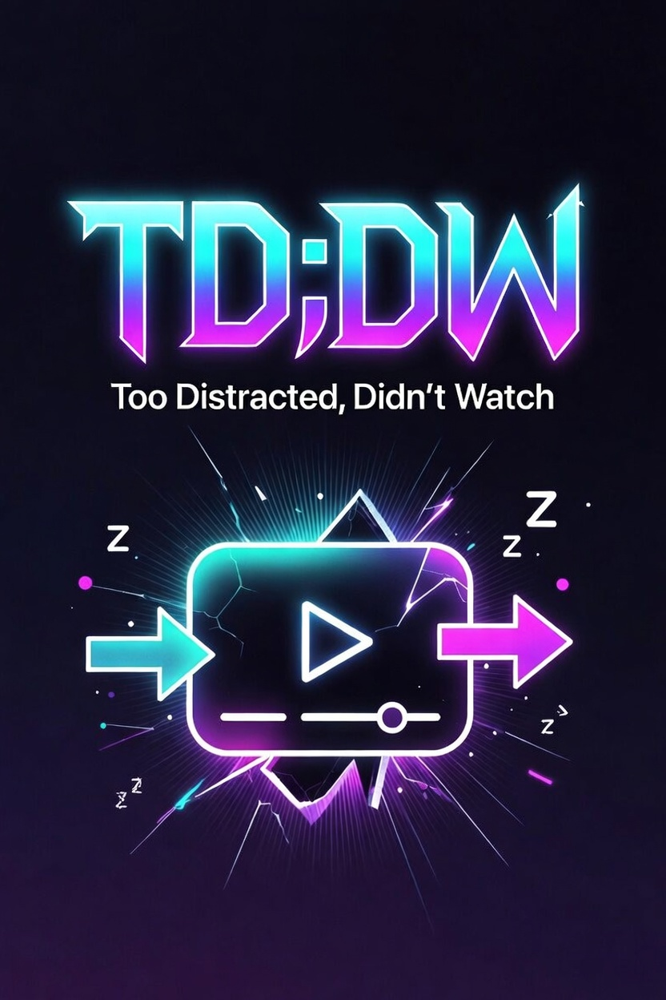

  
  <h1>TD;DW</h1>
  
<strong>Too Distracted, Didn't Watch.</strong> Spoiler-free "what did I miss?" for the video you're already watching.

Activate it mid-video and get a recap of everything that happened **up to your current
timestamp** — nothing past it. Works on YouTube, Netflix, Prime Video, Disney+, and your own
**Jellyfin** server.

## Before you start (read first)

- **You need an LLM endpoint.** Pick a provider in the extension options:
  - **OpenRouter** — one key, every model.
  - **Google Gemini (AI Studio)** — uses your [AI Studio](https://aistudio.google.com/apikey)
    key via Google's OpenAI-compatible endpoint. Great if you have AI Studio credits.
  - **Custom / Local** — any OpenAI-compatible endpoint (Ollama, LM Studio, llama.cpp).
- **Model choice matters most in knowledge mode.** For titles TD;DW recaps *from the model's
  own memory* (Netflix/Disney, or a Jellyfin item with no subtitles), small models give vague,
  plot-shaped filler — reach for a stronger model there. **Transcript mode** (YouTube captions,
  Jellyfin subtitles) feeds the model the real dialogue, so it's accurate even on cheap/fast
  models and even for brand-new or obscure content.
- **Every recap tells you where it came from.** A badge at the top reads **green — "Built from
  this title's subtitles"** (grounded, trustworthy) or **amber — "From the model's memory — may
  be imperfect"** (recalled from training; read as a refresher). It's the honest signal — not a
  made-up confidence score.
- **The keyboard shortcut can silently collide** with an existing binding — check/change it at
  `chrome://extensions/shortcuts`.
- **Disney+ (ad tier)**: playback position is read from the player's own scrub bar, because the
  raw video stream includes stitched-in ads. If you get "couldn't read the playback position",
  move your mouse over the player so the controls appear, then hit "Refresh at current time".

## Install

1. `chrome://extensions` → enable **Developer mode** → **Load unpacked** → pick this folder.
2. Open the extension's **Details → Extension options**, choose your provider, paste your API
   key (or local endpoint URL), **Test connection**, **Save**.

## Use

- On a supported watch page: click the toolbar icon or press **Alt+Shift+U**.
- The video pauses (configurable) and an overlay shows bullet points covering everything up to
  the current time. In transcript mode, click a bullet's time chip to jump the video to that
  moment.
- Keep watching, then hit **Refresh at current time** to extend the recap.

### Jellyfin

Point TD;DW at your Jellyfin web UI in options (**Jellyfin server URL**, e.g.
`http://jellyfin.local:8096`) and **reload the Jellyfin tab**. It runs on the Jellyfin page itself,
reads your logged-in session token from the page (no separate API key), and pulls the item's
**subtitle track up to your timestamp** for a transcript-grade recap of anything in your library
— movies included. Items with only image-based subs (PGS/VOBSUB) or no subs fall back to
knowledge mode automatically.

## Permissions & privacy

**What it sends, and where.** TD;DW has no backend, no analytics, no telemetry. The only
thing that leaves your machine is the recap request — the title, plus (in transcript mode)
the subtitles up to your current timestamp — and it goes **only to the LLM endpoint you
configure, with your own API key**. Nothing is logged, and nothing phones home. (The sole
extra outbound header is an `HTTP-Referer`/`X-Title` on OpenRouter requests, which OpenRouter
uses for app attribution — it says nothing about you.)

**Why the permissions look the way they do:**

- **`storage`** — saves your settings (provider, model, Jellyfin URL) in `chrome.storage.local`.
  Your API key lives here and never leaves except as the `Authorization` header to *your*
  endpoint.
- **`scripting`** — registers the Jellyfin adapter on your server's own origin at runtime
  (that address isn't known at build time, so it can't be a static entry).
- **Default site access is deliberately minimal** — the extension only auto-runs on
  **YouTube, Netflix, Prime Video, and Disney+** (the `content_scripts` block in the
  manifest), plus `openrouter.ai` for the default provider. That's it on install.
- **The broad optional host permission (`https://*/*`, `http://*/*`) is _not_ granted on
  install.** It exists so that *if* you point TD;DW at a custom LLM endpoint or your own
  Jellyfin server, it can request access to **that one origin** — you'll get the normal Chrome
  prompt for the specific host, nothing wider. Stick to OpenRouter/Gemini on the built-in
  sites and it's never requested.

**Honest caveats:**

- In transcript mode your subtitles are sent to a third-party model; in knowledge mode only
  the title is. Either way, a cloud LLM sees whatever you send it — pick an endpoint you trust
  (or run a local one).
- YouTube captions are fetched through YouTube's internal InnerTube API — a technique, not an
  official/supported endpoint — so that path can break when YouTube changes things.

## Architecture (for future me)

- **Content scripts share `globalThis.TDDW`** (no build step); the manifest loads them in
  dependency order. The overlay is a closed-shadow-DOM panel that never passes LLM output
  through `innerHTML`. (CSS class prefix is `cmu-`; the config storage key is `catchMeUpConfig`
  — both legacy names kept deliberately to avoid churn / settings loss.)
- `content/adapters/` — one adapter per site behind a common interface: `matches(location)`,
  `getVideoState()` → `{service, title, episodeInfo, currentTimeSeconds, durationSeconds}`, and
  optional `getTranscriptUpTo(seconds)` → `{text, language, autoGenerated, truncated}`. The
  presence of `getTranscriptUpTo` is what routes a site into transcript mode. `index.js` is a
  first-match registry over `matches()`.
  - **Netflix/Prime/Disney** share the `dom-video-adapter.js` factory — a new streaming site is
    ~30 lines of config. Site DOM fragility stays in each site's `readTitle` / `readPlayerTime`.
  - **YouTube** fetches captions via the InnerTube ANDROID-client route (web `timedtext` is
    proof-of-origin-gated and returns empty bodies). Lines carry `[m:ss]` prefixes → seekable
    chips.
  - **Jellyfin** (`jellyfin.js` + `jellyfin-subtitles.js`) talks to the Jellyfin REST API
    same-origin: resolves the playing item, filters to text subtitle streams
    (`IsTextSubtitleStream`, excludes image subs), fetches `Stream.vtt`, clips cues past the
    timestamp. It's injected via **dynamic `chrome.scripting.registerContentScripts`** keyed off
    the configured server URL (the static `content_scripts` block can't know it at build time);
    registration is synced on save / install / startup.
- **Title fallback chain**: site DOM selectors → Media Session metadata (mirrored from the
  page's main world by `content/main-world/media-session-probe.js`, survives player redesigns) →
  site-specific extras (Disney: tab title; Jellyfin: item metadata from the API).
- **Position**: `video.currentTime`, EXCEPT ad-stitched players (Disney+ ad tier reports
  `duration: Infinity` and stream time incl. ads) — those set `playerTimeOnly` and read the
  player UI's Timeline slider via `TDDW.queryDeepAll()`, which pierces open shadow DOM and
  same-origin iframes.
- `background/providers/` — recap engines behind `pickProvider()`: **transcript** when the
  adapter supplied captions/subtitles, **knowledge** otherwise. Each result carries a
  `source` field that the overlay renders as the provenance badge. Adding an engine is one file
  + one registry line.
- `background/providers/prompts.js` — all spoiler-safety and identification rules. Iterate here;
  it is the product.
- `background/llm-client.js` — single OpenAI-compatible client (`{baseUrl, apiKey, model}`),
  fetched straight from the MV3 service worker; strips `<think>` blocks from local reasoning
  models. OpenRouter, Gemini, and local endpoints all speak this one protocol.

## Roadmap

- Polish pass: shortcut-collision check, options UX, a "(partial)" note when a very long
  transcript gets sampled down.
- Package for the Chrome Web Store.

## Credits

- YouTube caption retrieval is adapted from the technique in the open-source
  [`youtube-transcript`](https://www.npmjs.com/package/youtube-transcript) package (MIT) —
  the InnerTube ANDROID-client recipe — reworked here for a browser content-script context.

## License

[MIT](LICENSE) © 2026 Marc Tooze. You bring your own LLM endpoint and API key; TD;DW never
ships or proxies one.

Not affiliated with, endorsed by, or connected to YouTube, Netflix, Prime Video, Disney+,
Jellyfin, or any LLM provider. All trademarks belong to their respective owners.
